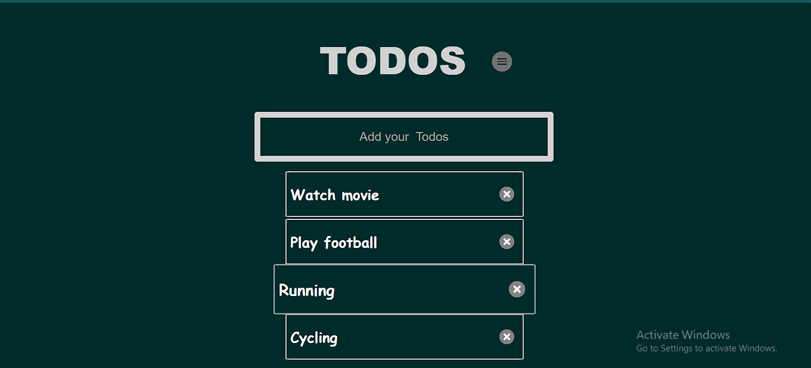
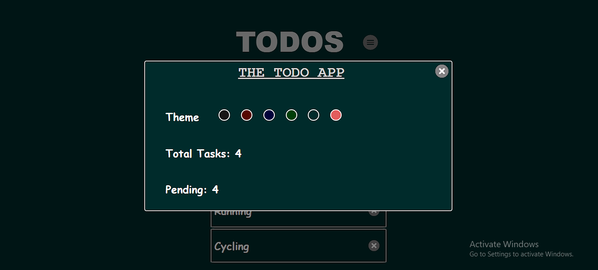

# Todo-Web-App

The Todo-Web-App is a simple and interactive web application developed using HTML, CSS, and JavaScript. It allows users to create and manage their todo tasks effectively.

## Technologies Used

- HTML
- CSS
- JavaScript

## Features

- Add new tasks to the todo list.
- Mark tasks as completed or pending by clicking on them.
- Delete tasks once they are completed or no longer needed.
- Change the app theme from the menu.
- Store tasks in local storage for persistence across browser sessions.
- Same goes for the themes as well.
- View the total number of tasks and pending tasks in the menu.

## Installation

To run the Todo-Web-App locally:

1. Clone the repository to your local machine.
3. Open the `index.html` file in a web browser.
4. Start using the Todo-Web-App to manage your tasks.

To run the Todo-Web-App online:
1. Go to https://kkbhati07.github.io/Todo-Web-App/ from your browser.

## Screenshots

